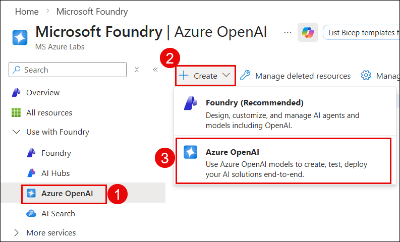
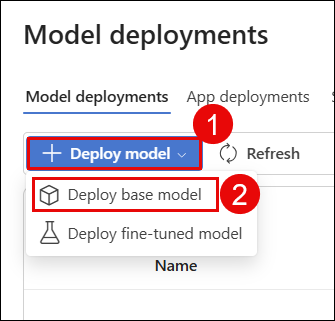
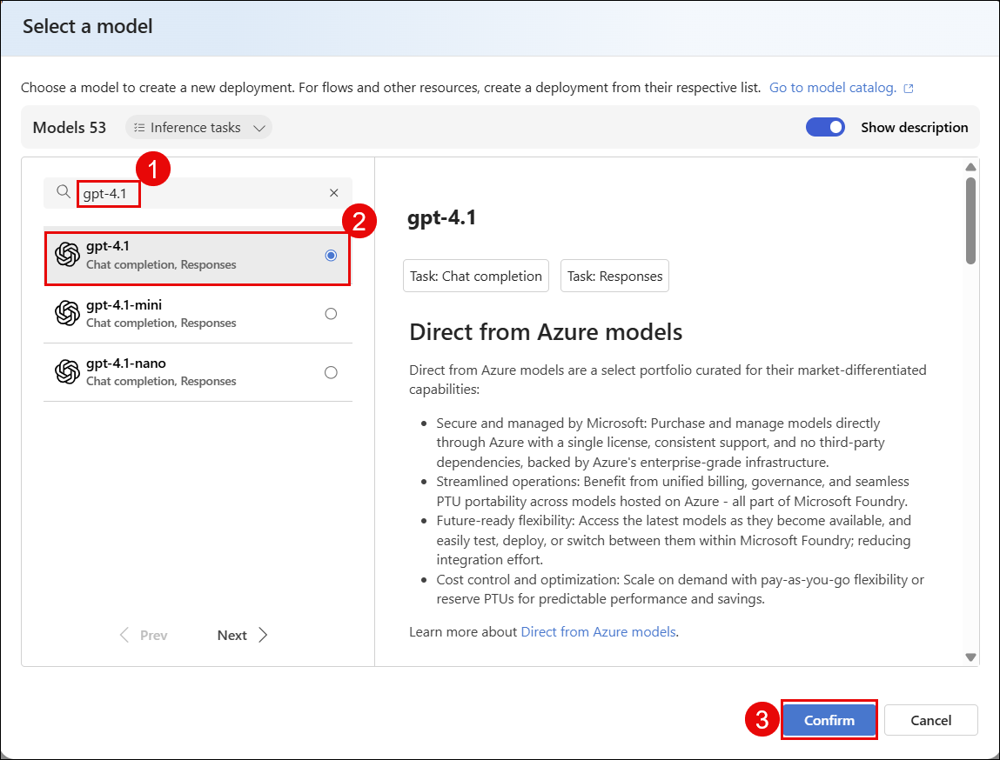
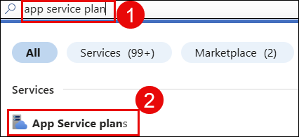
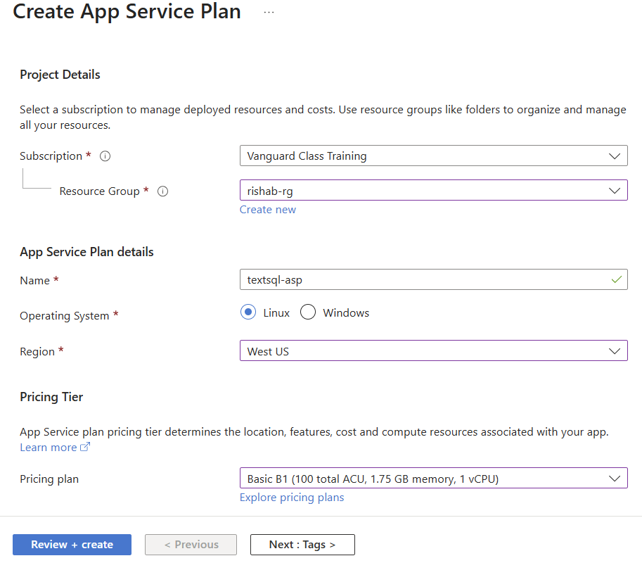
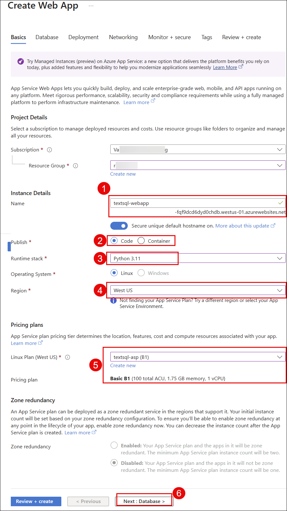
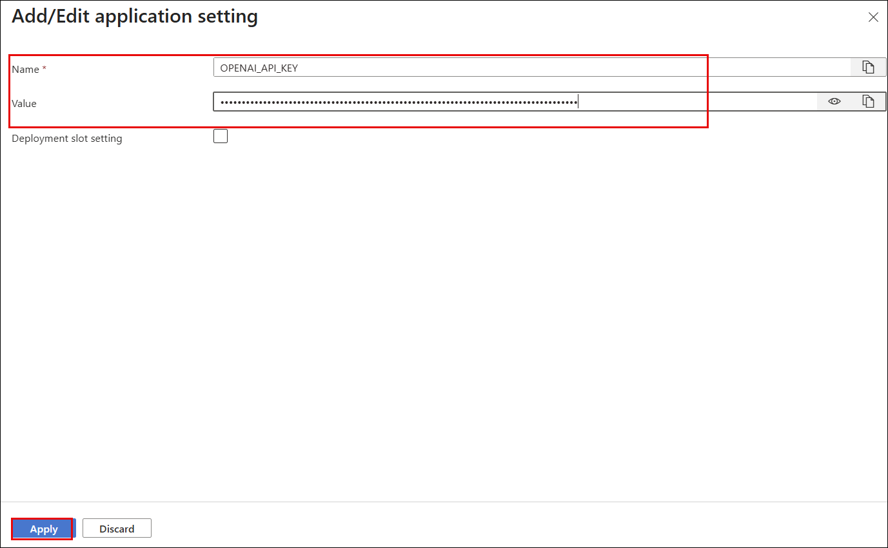
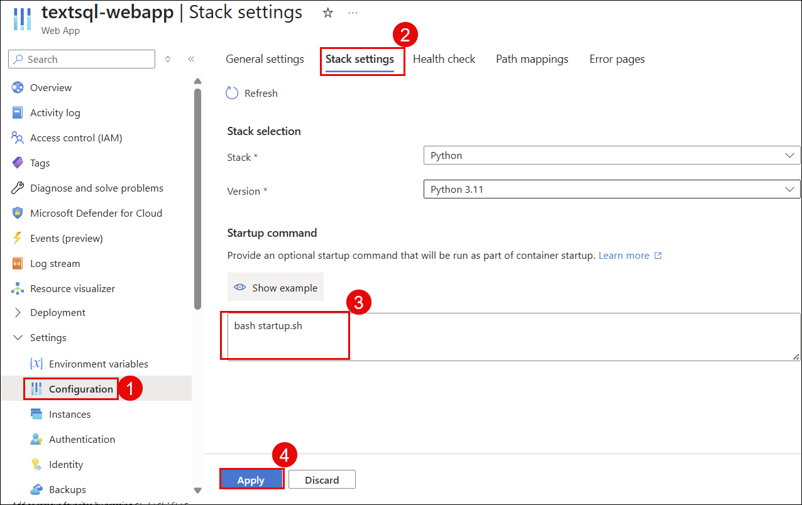

# Lab 02: Creating Azure OpenAI Service & App Service

## Lab scenario

In this lab, you will provision the two remaining Azure services: Azure OpenAI (the AI engine that converts natural language to SQL) and Azure App Service (the web server that hosts your Python application). You will also configure all required environment variables on the App Service.

## Lab objectives

In this lab, you will complete the following tasks:

- Task 1: Create Azure OpenAI Service
- Task 2: Deploy GPT-4.1 Model
- Task 3: Note Your OpenAI Credentials
- Task 4: Create App Service Plan
- Task 5: Create App Service
- Task 6: Configure Environment Variables
- Task 7: Set Startup Command

## Estimated time: 60 minutes

### Task 1: Create Azure OpenAI Service

Azure OpenAI Service gives you access to OpenAI's GPT-4.1 model through Microsoft's secure cloud. This is the AI brain of your application — it reads your question, understands your database schema, and generates the correct SQL query automatically.

1. In the Azure Portal search bar, type **OpenAI** and select it.

   

2. On the next screen, make sure you have selected **Azure OpenAI (1)**, then click on **Create (2)** and select **Azure OpenAI (3)**.

   

3. On the **Basics** tab, fill in the following details:

   - **Subscription**: Your subscription
   - **Resource Group**: `textsql-rg`
   - **Region**: `West US` (best GPT-4.1 availability)
   - **Name**: `textsql-openai`
   - **Pricing Tier**: `Standard S0`

   

4. Click **Next** on the Network tab (leave defaults — All networks).

5. Click **Next** on the Tags tab.

6. Click **Review + Create**, then click **Create**.

7. Wait for deployment (2–3 minutes), then click **Go to resource**.

   

   > **Verify:** OpenAI resource shows status **Active**.

### Task 2: Deploy GPT-4.1 Model

Creating the Azure OpenAI resource alone is not enough — you must deploy a specific AI model inside it. You will deploy GPT-4.1, which will be the model used by your application to generate SQL queries and format natural language answers.

1. Inside `textsql-openai`, click **Go to Foundry Portal**.

   > **Note**: This opens the Foundry Portal in a new tab, which is where you manage your OpenAI models and deployments.

2. Under the shared resources section in the left menu, click on **Deployments**.

3. Click **+ Deploy model (1)**, then select **Deploy base model (2)**.

   

4. In the model list, search for **gpt-4.1 (1)** and select **gpt-4.1 (2)**.

   

5. Click **Confirm (3)**.

6. On the deployment dialog, click on **Customize** and fill in the following details:

   - **Deployment name**: `gpt-4-1`
   - **Deployment Type**: Global Standard
   - **Model version**: Latest available
   - **Tokens per minute (TPM)**: 10K or higher

   

7. Click **Deploy** and wait for status to show **Succeeded**.

   

   > **Verify:** Model `gpt-4-1` shows state **Succeeded** in deployments info.

### Task 3: Note Your OpenAI Credentials

You will need the OpenAI endpoint URL and API key when configuring your App Service environment variables. Save these values now.

1. Inside `textsql-openai`, go to **Resource Management → Keys and Endpoint** in the left menu.

2. Copy and save the following values:

   - **Endpoint**: `https://textsql-openai.openai.azure.com/`
   - **KEY 1**: (copy the full key value)

   

   > **Note**: Save these values — you will use them in Task 6.

### Task 4: Create App Service Plan

The App Service Plan defines the compute resources — CPU, RAM, and pricing tier — that power your web application. Think of it as the "server" that your App Service runs on.

1. In the Azure Portal search bar, type **App Service plans** and select it.

   

2. Click **+ Create**.

3. Fill in the following details:

   - **Subscription**: Your subscription
   - **Resource Group**: `textsql-rg`
   - **Name**: `textsql-asp`
   - **Operating System**: `Linux`
   - **Region**: `West US`
   - **Pricing Plan**: Click **Explore pricing plans** → Select **Basic B1**

   

4. Click **Review + Create**, then click **Create**.

   > **Verify:** App Service Plan `textsql-asp` created with OS = Linux.

   

### Task 5: Create App Service

The App Service is the actual web application host. It will run your Python FastAPI application 24/7 and serve it via a public HTTPS URL. All users will access your application through this URL.

1. In the Azure Portal search bar, type **App Services** and select it.

   

2. Click **+ Create**, then select **Web App**.

   

3. On the **Basics** tab, fill in the following details:

   - **Subscription**: Your subscription
   - **Resource Group**: `textsql-rg`
   - **Name (1)**: `textsql-webapp`
   - **Publish (2)**: `Code`
   - **Runtime Stack (3)**: `Python 3.11`
   - **Operating System**: `Linux`
   - **Region (4)**: `West US`
   - **Linux Plan (5)**: Select `textsql-asp`

   

4. Click **Next: Database**, leave defaults → **Deployment**, leave defaults → click **Next: Networking**, leave defaults.

5. Click **Review + Create**, then click **Create**.

6. Wait for deployment, then click **Go to resource**.

   

   > **Verify:** App Service URL = `https://textsql-webapp.azurewebsites.net` and Status = **Running**.

### Task 6: Configure Environment Variables

Your Python application reads its configuration from environment variables — these are secure key-value pairs stored on the App Service. You will add all the connection details your app needs to talk to Azure OpenAI and Azure SQL.

1. Inside `textsql-webapp`, go to **Settings → Environment Variables** in the left menu.

2. Click **+ Add** for each of the following variables one by one and click **Apply** after adding each variable:

   

   | Variable Name | Value |
   |---|---|
   | `OPENAI_API_KEY` | Your KEY 1 from Task 3 |
   | `AZURE_OPENAI_ENDPOINT` | `https://textsql-openai.openai.azure.com/` |
   | `AZURE_OPENAI_VERSION` | `2024-12-01-preview` |
   | `AZURE_OPENAI_CHAT_DEPLOYMENT` | `gpt-4-1` |
   | `SQL_SERVER` | `textsql-sqlserver.database.windows.net` |
   | `SQL_DATABASE` | `textsqldb` |

3. Click **Apply**, then click **Confirm** to save and restart the app.

   

   > **Verify:** All 6 environment variables appear in the list and are saved.

### Task 7: Set Startup Command

Azure App Service needs to know how to start your Python application. You will set the startup command that installs dependencies and launches the FastAPI server using Gunicorn.

1. Inside `textsql-webapp`, go to **Settings → Configuration (1)** in the left menu.

2. Click the **Stack settings** tab.

3. Find **Startup Command (3)** and enter the following:

   ```
   bash startup.sh
   ```

   

4. Click **Apply**, then click **Continue**.

   > **Verify:** Startup command saved as `bash startup.sh`.

## Review

In this lab, you have accomplished the following:

- Created an Azure OpenAI resource (`textsql-openai`) in West US
- Deployed the GPT-4.1 model with deployment name `gpt-4-1`
- Saved the OpenAI Endpoint and API Key for app configuration
- Created an App Service Plan (`textsql-asp`) on Linux with Basic B1 pricing
- Created an App Service (`textsql-webapp`) running Python 3.11 on Linux
- Added all 6 required environment variables to the App Service
- Set the startup command to `bash startup.sh`

### You have successfully completed the lab.
