# Lab 03: Configuring Security & Managed Identity

## Lab scenario

In this lab, you will implement enterprise-grade security using Azure Managed Identity. Instead of storing passwords or API keys in your code, your application will use its own Azure identity to authenticate with OpenAI and SQL Database securely. You will create a User Managed Identity, assign it to the App Service, and grant it the correct permissions on each resource.

## Lab objectives

In this lab, you will complete the following tasks:

- Task 1: Create User Managed Identity
- Task 2: Assign Managed Identity to App Service
- Task 3: Grant OpenAI Access to Managed Identity
- Task 4: Grant SQL Database Access to Managed Identity

## Estimated time: 45 minutes

### Task 1: Create User Managed Identity

A User Assigned Managed Identity is a standalone Azure identity resource that can be assigned to multiple services. Your App Service will use this identity to authenticate with Azure OpenAI and Azure SQL Database — no passwords required anywhere.

1. In the Azure Portal search bar, type **Managed Identities** and select it.

   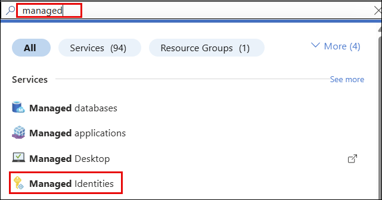

2. Click **+ Create**.

   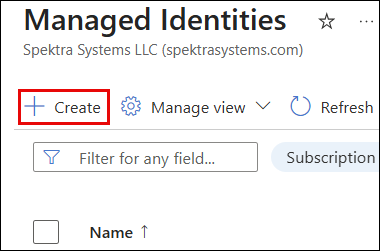

3. Fill in the following details:

   - **Subscription**: Your subscription
   - **Resource Group**: `textsql-rg`
   - **Region**: `West US`
   - **Name**: `textsql-identity`

4. Click **Review + Create**, then click **Create**.

   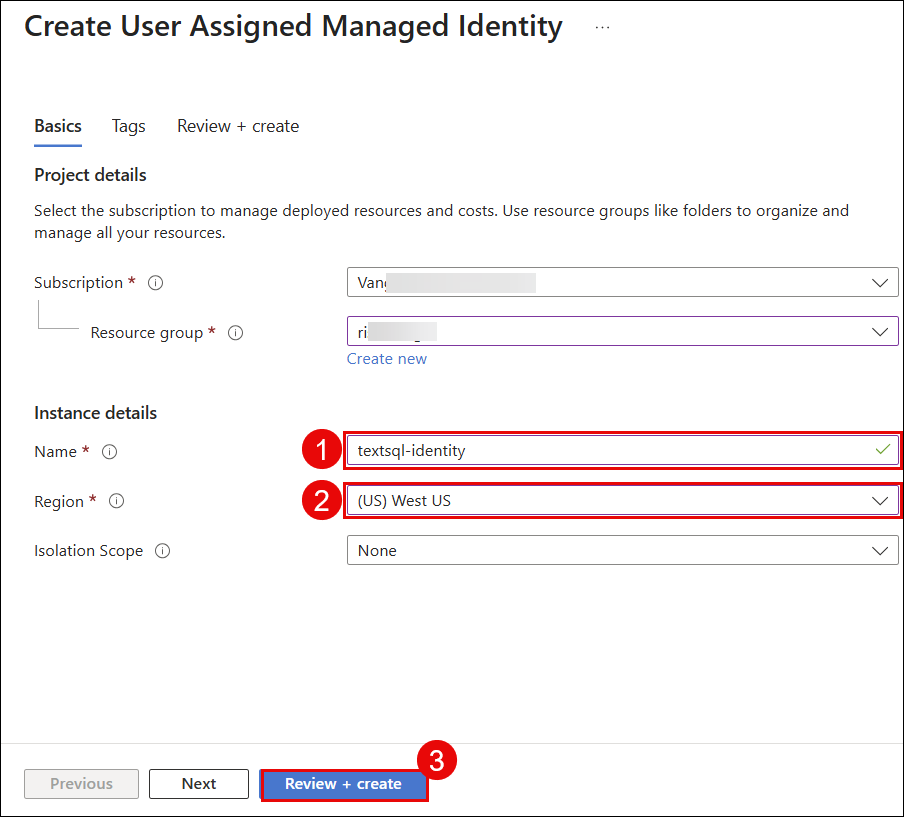

5. Click **Go to resource** and note the **Client ID** and **Principal ID** — you may need these later.

   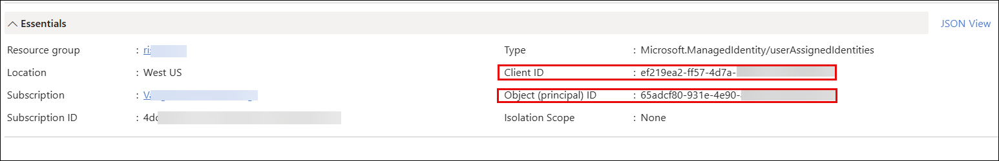

   > **Note**: The Managed Identity overview shows `textsql-identity` with its Client ID and Object Principal ID.

   > **Verify:** Managed Identity `textsql-identity` created successfully.

  **Congratulations** on completing the task! Now, it's time to validate it. Here are the steps:

  > - Navigate to the Lab Validation tab, from the upper right corner in the lab guide section.
  > - Hit the Validate button for the corresponding task. If you receive a success message, you can proceed to the next task.
  > - If not, carefully read the error message and retry the step, following the instructions in the lab guide.
  > - If you need any assistance, please contact us at cloudlabs-support@spektrasystems.com.

### Task 2: Assign Managed Identity to App Service

Now you will attach the `textsql-identity` to your App Service. Once attached, the App Service will automatically use this identity when making requests to other Azure services.

1. Navigate to your App Service `textsql-webapp`.

2. In the left menu, go to **Settings → Identity (1)**.

3. Click the **User assigned (2)** tab.

4. Click **+ Add (3)**.

   

5. In the dropdown, select `textsql-identity` and click **Add**.

   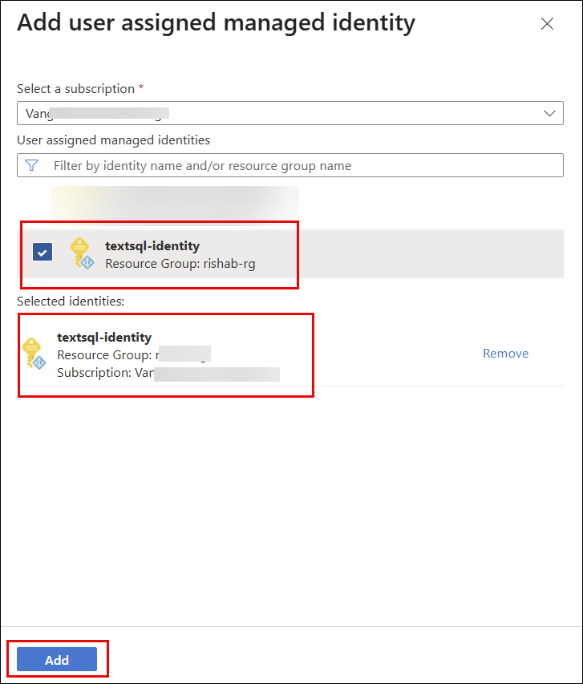

6. In the System Assigned option, turn the status to **On** and click **Save**.

   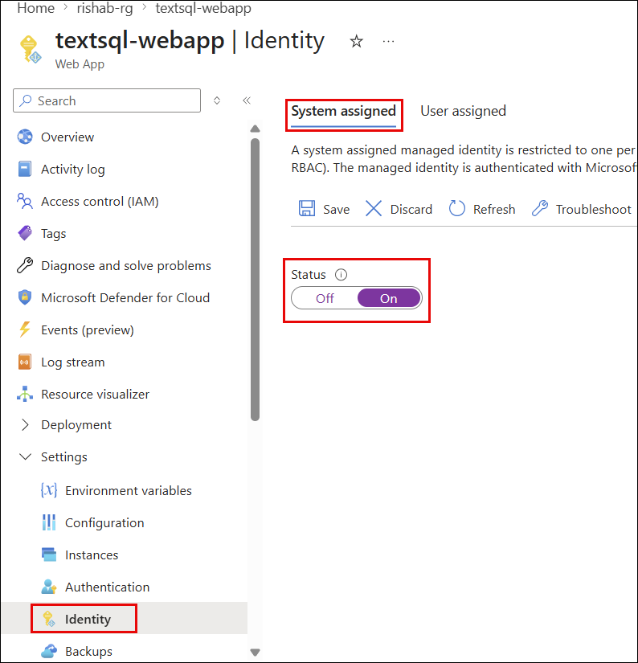

   > **Verify:** `textsql-identity` appears under User assigned identities with Status = **Assigned**.

### Task 3: Grant OpenAI Access to Managed Identity

You will assign the **Cognitive Services OpenAI User** RBAC role to your Managed Identity on the Azure OpenAI resource. This allows your App Service to call the OpenAI API using its identity — without any API key in the code.

1. Navigate to your Azure OpenAI resource `textsql-openai`.

2. In the left menu, click **Access Control (IAM) (1)**.

3. Click **+ Add (2)**, then select **Add role assignment (3)**.

   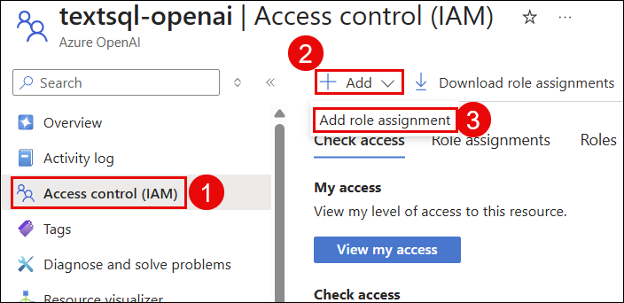

4. On the **Role** tab, search for the following role, select it, and click **Next**:

   ```
   Cognitive Services OpenAI User
   ```

   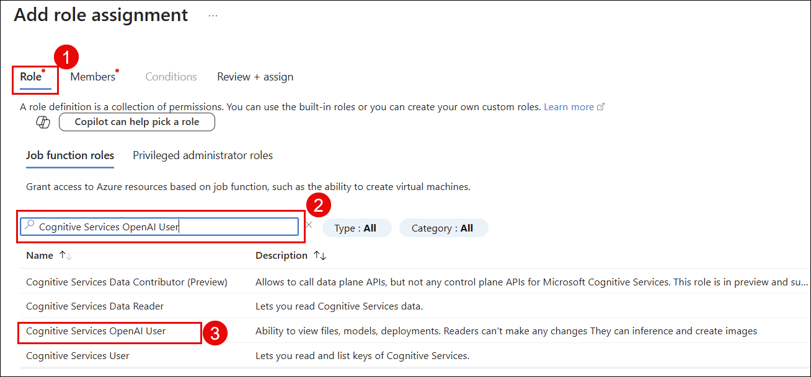

5. On the **Members** tab, configure the following:

   - **Assign access to**: Select `Managed Identity`
   - Click **+ Select members**
   - In the dropdown, select **User-assigned managed identity**
   - Find and select `textsql-identity`
   - Click **Select**

   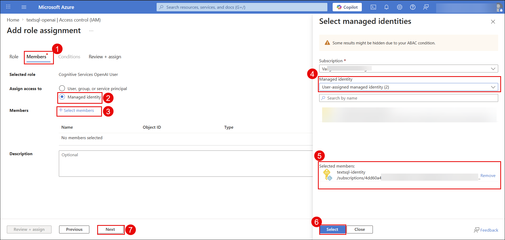

6. Click **Review + Assign**, then click **Review + Assign** again to confirm.

7. Go to **Access Control (IAM) → Role assignments** tab and verify the role appears.

   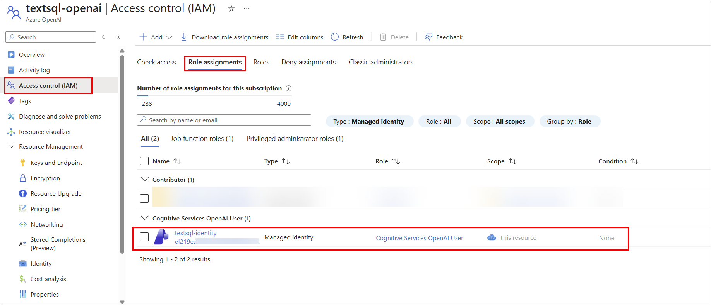

   > **Verify:** Role assignment shows `textsql-identity` → `Cognitive Services OpenAI User`.

### Task 4: Grant SQL Database Access to Managed Identity

Your Managed Identity also needs access to the Azure SQL Database. You will do this by running a SQL command in the Query Editor that creates a database user mapped to the Managed Identity.

1. Navigate to your SQL Database `textsqldb` in the Azure Portal.

2. Click **Query editor (preview)** in the left menu.

3. Sign in using **Active Directory authentication**.

   > **Note**: You may encounter an error while logging into the database. It usually occurs when your network changes and your IP address is updated. To resolve it, click on **Add your IP address** in the firewall settings, allow the new IP, and then try logging in again. Changes may take a few minutes to take effect.

   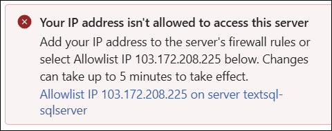

4. In the query window, run the following SQL:

   ```sql
   -- Create a user for the Managed Identity
   CREATE USER [textsql-identity] FROM EXTERNAL PROVIDER;

   -- Grant the user read and write permissions
   ALTER ROLE db_datareader ADD MEMBER [textsql-identity];
   ALTER ROLE db_datawriter ADD MEMBER [textsql-identity];
   ```

   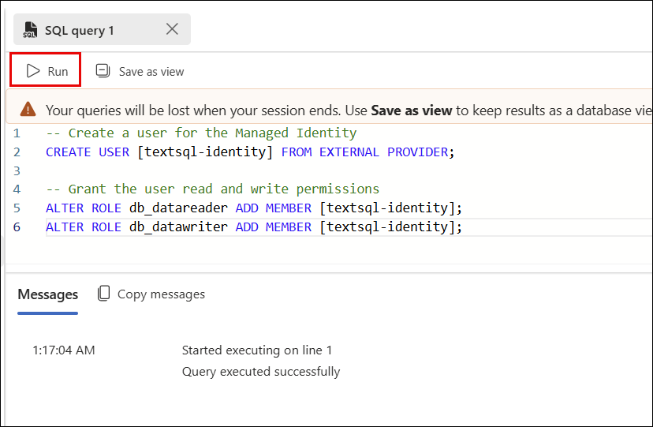

5. Verify the user was created by running the following query:

   ```sql
   SELECT name, type_desc FROM sys.database_principals
   WHERE name = 'textsql-identity'
   ```

   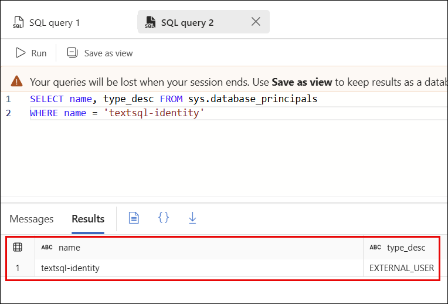

   > **Verify:** Query returns `textsql-identity` with `type_desc = EXTERNAL_USER`.

6. The App Service's System Assigned Managed Identity also needs access to the database to authenticate successfully. In the query window, run the following SQL:

   ```sql
   -- Create a user for the App Service System Assigned Identity
   CREATE USER [textsql-webapp] FROM EXTERNAL PROVIDER;

   -- Grant the user read and write permissions
   ALTER ROLE db_datareader ADD MEMBER [textsql-webapp];
   ALTER ROLE db_datawriter ADD MEMBER [textsql-webapp];
   ```

   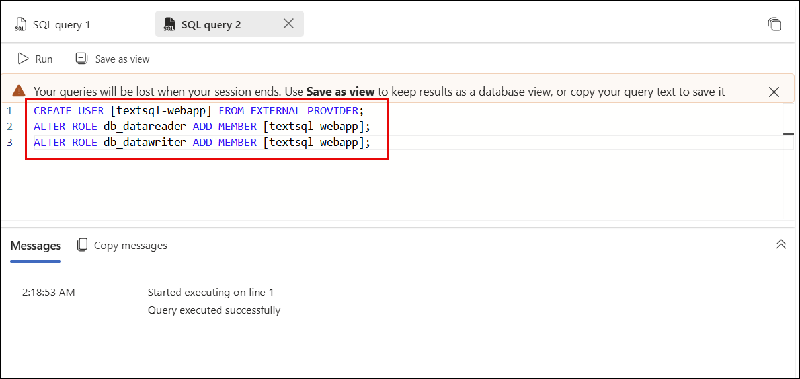

7. Verify the user was created by running the following query:

   ```sql
   SELECT name, type_desc FROM sys.database_principals
   WHERE name = 'textsql-webapp'
   ```

   > **Verify:** Query returns `textsql-webapp` with `type_desc = EXTERNAL_USER`.

## Review

In this lab, you have accomplished the following:

- Created a User Assigned Managed Identity (`textsql-identity`) in the `textsql-rg` resource group
- Assigned `textsql-identity` to the App Service `textsql-webapp`
- Assigned the `Cognitive Services OpenAI User` role to `textsql-identity` on the OpenAI resource
- Created SQL Database users for both `textsql-identity` and `textsql-webapp` from external providers
- Granted `db_datareader` and `db_datawriter` roles to both identities

### You have successfully completed the lab.
