# Lab 04: Deploying the Application & Testing

## Lab scenario

In this lab, you will prepare the application code files, create the deployment package, deploy it to Azure App Service using the Azure CLI, and then test the complete end-to-end solution by asking natural-language questions through the web interface.

## Lab objectives

In this lab, you will complete the following tasks:

- Task 1: Create Application Files Locally
- Task 2: Review Application Files
- Task 3: Deploy Application to Azure App Service
- Task 4: Verify Deployment via Logs
- Task 5: Test the Application
- Task 6: Verify in Azure Portal

## Estimated time: 60 minutes

### Task 1: Create Application Files Locally

Create a dedicated folder on your local machine and save all the application files.

1. Open **VS Code** on your local machine, then create a new folder from the terminal and navigate into it:

   ```
   C:\Users\YourName\> mkdir textsql-app
   C:\Users\YourName\> cd textsql-app
   ```

2. Inside that folder, create the following 3 files using VS Code or Notepad:

   - `main.py`
   - `requirements.txt`
   - `startup.sh`

   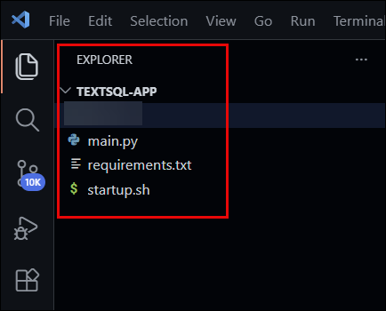

   > **Verify:** All 3 files exist in your local folder.

### Task 2: Review Application Files

Before deploying, review the files that make up your application. Each file has a specific role in the Function Call Dynamic Query pipeline.

Your project structure should look like this:

```
textsql-app/
├── main.py            ← FastAPI app + AI pipeline + Web UI
├── requirements.txt   ← Python package dependencies
├── startup.sh         ← Azure App Service startup script
└── .env               ← Local environment variables (NOT deployed)
```


#### File 1: `main.py`

The core application file. It includes the FastAPI web server, an Azure SQL connection using Managed Identity, the OpenAI integration for generating SQL queries, and the HTML chat interface served to users. Copy and paste the following code into `main.py`:

```python
import os
import struct
import pyodbc
from openai import AzureOpenAI
from azure.identity import AzureCliCredential, ManagedIdentityCredential
from dotenv import load_dotenv
from fastapi import FastAPI
from fastapi.responses import HTMLResponse
from pydantic import BaseModel

load_dotenv()

# ── OpenAI Client ──────────────────────────────────────────────────
client = AzureOpenAI(
    api_key=os.getenv("OPENAI_API_KEY"),
    api_version=os.getenv("AZURE_OPENAI_VERSION"),
    azure_endpoint=os.getenv("AZURE_OPENAI_ENDPOINT")
)
DEPLOYMENT_NAME = os.getenv("AZURE_OPENAI_CHAT_DEPLOYMENT")
SQL_SERVER = os.getenv("SQL_SERVER")
SQL_DATABASE = os.getenv("SQL_DATABASE")

app = FastAPI()

# ── Connection: Auto-detect Local vs Azure ─────────────────────────
def get_sql_connection():
    if os.getenv("WEBSITE_INSTANCE_ID"):  # On Azure → Managed Identity
        credential = ManagedIdentityCredential()
    else:  # Local → Azure CLI login
        credential = AzureCliCredential()

    token = credential.get_token("https://database.windows.net/.default")
    token_bytes = token.token.encode("utf-16-le")
    token_struct = struct.pack(f"<I{len(token_bytes)}s", len(token_bytes), token_bytes)

    conn_str = (
        "Driver={ODBC Driver 18 for SQL Server};"
        f"Server=tcp:{SQL_SERVER},1433;"
        f"Database={SQL_DATABASE};"
        "Encrypt=yes;"
        "TrustServerCertificate=no;"
    )
    return pyodbc.connect(conn_str, attrs_before={1256: token_struct})

# ── Generate SQL from natural language ────────────────────────────
def generate_sql(question):
    response = client.chat.completions.create(
        model=DEPLOYMENT_NAME,
        messages=[
            {
                "role": "system",
                "content": """You are an Azure SQL expert.

Database Schema:
- SalesLT.Customer(CustomerID, FirstName, LastName, EmailAddress, Phone, CompanyName)
- SalesLT.Product(ProductID, Name, ProductNumber, Color, StandardCost, ListPrice, Size, Weight)
- SalesLT.SalesOrderDetail(SalesOrderID, SalesOrderDetailID, OrderQty, ProductID, UnitPrice, LineTotal)

Rules:
- ONLY generate SELECT queries
- ALWAYS use full table names like SalesLT.Product
- ALWAYS use TOP N instead of LIMIT (Azure SQL syntax)
- Default to TOP 10 unless user specifies
- Return ONLY raw SQL, no markdown, no backticks, no explanation"""
            },
            {"role": "user", "content": question}
        ]
    )
    sql = response.choices[0].message.content.strip()
    sql = sql.replace("```sql", "").replace("```", "").strip()
    return sql

# ── Execute SQL against Azure SQL Database ────────────────────────
def execute_sql(sql):
    try:
        conn = get_sql_connection()
        cursor = conn.cursor()
        cursor.execute(sql)
        columns = [col[0] for col in cursor.description]
        rows = cursor.fetchall()
        return [dict(zip(columns, row)) for row in rows]
    except Exception as e:
        return f"SQL Error: {e}"

# ── Format results as natural language ────────────────────────────
def generate_answer(question, data):
    response = client.chat.completions.create(
        model=DEPLOYMENT_NAME,
        messages=[
            {
                "role": "system",
                "content": "You are a helpful business assistant. Answer the user's question based on the database results. Be concise and clear. Do NOT mention SQL or databases."
            },
            {
                "role": "user",
                "content": f"Question: {question}\nData: {data}"
            }
        ]
    )
    return response.choices[0].message.content

# ── Chat UI served at root URL ────────────────────────────────────
@app.get("/", response_class=HTMLResponse)
async def home():
    return """
    <!DOCTYPE html>
    <html>
    <head>
        <title>Text to SQL — Azure OpenAI</title>
        <style>
            body { font-family: Arial; max-width: 800px; margin: 50px auto; padding: 20px; background: #f5f5f5; }
            h1 { color: #0078d4; }
            input { width: 70%; padding: 10px; font-size: 16px; border: 1px solid #ccc; border-radius: 5px; }
            button { padding: 10px 20px; font-size: 16px; background: #0078d4; color: white; border: none; border-radius: 5px; cursor: pointer; }
            button:hover { background: #005a9e; }
            #result { margin-top: 30px; background: white; padding: 20px; border-radius: 10px; display: none; }
            #sql { background: #f0f0f0; padding: 10px; border-radius: 5px; font-family: monospace; font-size: 13px; }
            #answer { font-size: 16px; color: #333; margin-top: 15px; }
            .loading { color: #0078d4; }
        </style>
    </head>
    <body>
        <h1>🔍 Text to SQL — Powered by Azure OpenAI</h1>
        <p>Ask anything about your database in plain English</p>
        <input type="text" id="question" placeholder="e.g. give me top 5 selling products" />
        <button onclick="ask()">Ask</button>
        <div id="result">
            <h3>Generated SQL:</h3>
            <div id="sql"></div>
            <h3>Answer:</h3>
            <div id="answer"></div>
        </div>
        <script>
            async function ask() {
                const question = document.getElementById("question").value;
                if (!question) return;
                document.getElementById("answer").innerHTML = "<span class='loading'>Thinking...</span>";
                document.getElementById("sql").innerHTML = "";
                document.getElementById("result").style.display = "block";
                const response = await fetch("/ask", {
                    method: "POST",
                    headers: { "Content-Type": "application/json" },
                    body: JSON.stringify({ question })
                });
                const data = await response.json();
                document.getElementById("sql").innerText = data.sql;
                document.getElementById("answer").innerText = data.answer;
            }
            document.getElementById("question").addEventListener("keypress", function(e) {
                if (e.key === "Enter") ask();
            });
        </script>
    </body>
    </html>
    """

# ── API endpoint ──────────────────────────────────────────────────
class AskRequest(BaseModel):
    question: str

@app.post("/ask")
async def ask(request: AskRequest):
    sql = generate_sql(request.question)
    data = execute_sql(sql)
    answer = generate_answer(request.question, data)
    return { "question": request.question, "sql": sql, "answer": answer, "data": data }
```

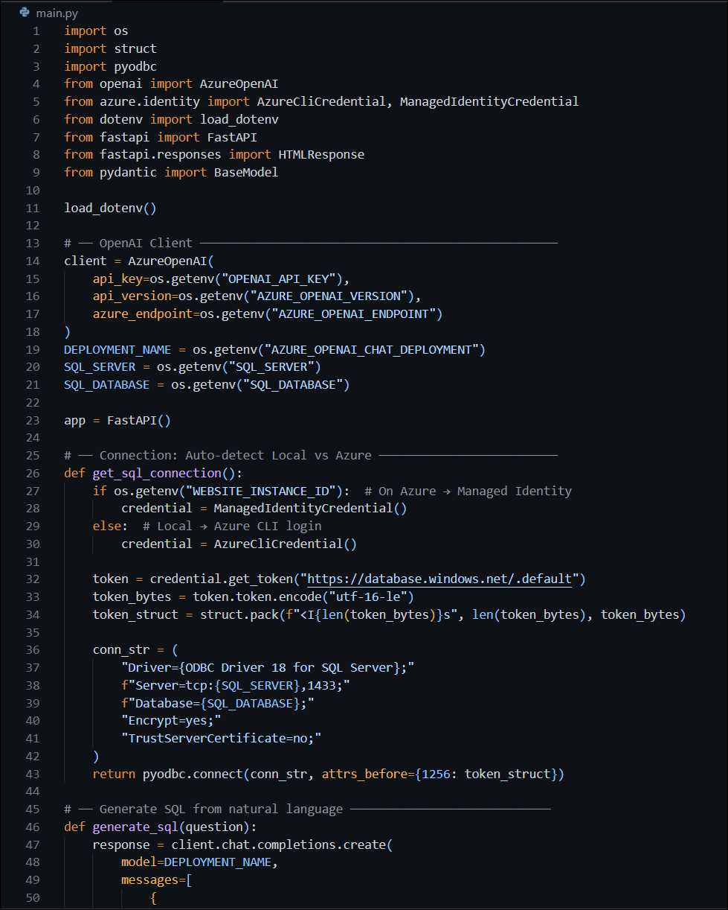

#### File 2: `requirements.txt`

Lists all Python packages your application needs. Azure App Service reads this file and installs all packages automatically during startup. Copy and paste the following into `requirements.txt`:

```txt
fastapi==0.112.1
uvicorn==0.30.1
gunicorn==21.2.0
pyodbc==5.1.0
openai==1.30.1
azure-identity==1.17.1
python-dotenv==1.0.1
pydantic==2.8.2
sqlparse==0.5.1
httpx==0.27.0
```

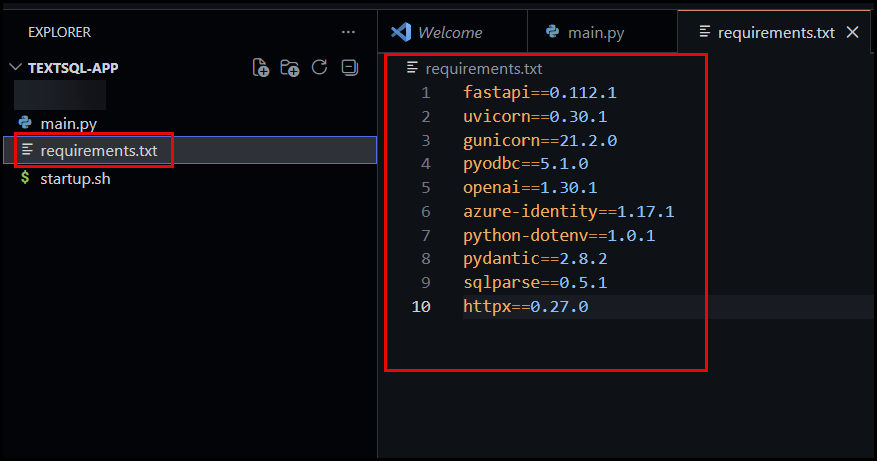

#### File 3: `startup.sh`

This shell script runs automatically when the Azure App Service starts your container. It installs all Python dependencies from `requirements.txt` and then starts the Gunicorn web server with Uvicorn workers to serve your FastAPI app. Copy and paste the following into `startup.sh`:

```bash
#!/bin/bash
echo "Installing Python packages..."
python3 -m pip install -r /home/site/wwwroot/requirements.txt
echo "Packages installed. Starting app..."
python3 -m gunicorn -w 4 -k uvicorn.workers.UvicornWorker main:app --bind 0.0.0.0:8000
```

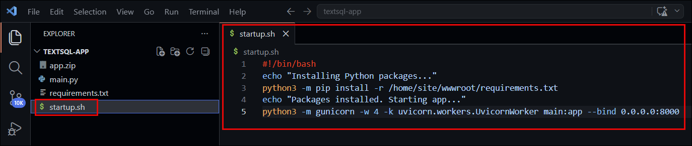

### Task 3: Deploy Application to Azure App Service

You will zip the application files and deploy them to Azure App Service using the Azure CLI. This uploads your code to the cloud where it will run permanently.

1. Open **PowerShell Terminal** and create the deployment zip:

   ```powershell
   cd C:\Users\YourName\textsql-app

   Compress-Archive -Path main.py, requirements.txt, startup.sh -DestinationPath app.zip -Force
   ```

2. Verify the zip was created:

   ```powershell
   Get-Item app.zip
   ```

   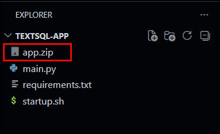

3. Open **Git Bash** in your VS Code terminal and deploy using Azure CLI:

   ```bash
   az webapp deploy \
     --resource-group textsql-rg \
     --name textsql-webapp \
     --src-path app.zip \
     --type zip
   ```

4. Restart the App Service to apply the new code:

   ```bash
   az webapp restart \
     --resource-group textsql-rg \
     --name textsql-webapp
   ```

   > **Verify:** Deployment shows `"complete": true` and `"status": 4`.

### Task 4: Verify Deployment via Logs

After deploying, watch the live application logs to confirm the startup script runs successfully, packages are installed, and the web server starts without errors.

1. In Git Bash, run the live log streaming command:

   ```bash
   az webapp log tail \
     --resource-group textsql-rg \
     --name textsql-webapp
   ```

2. Wait and watch for the following lines in the output:

   ```
   Installing Python packages...
   Packages installed. Starting app...
   Application startup complete.
   Uvicorn running on http://0.0.0.0:8000
   ```

3. If you see errors, refer to the table below for common fixes:

   | Error | Fix |
   |---|---|
   | `ModuleNotFoundError` | Check `requirements.txt` has all packages |
   | `gunicorn: command not found` | Ensure `startup.sh` uses `python3 -m gunicorn` |
   | `Connection refused` | Check environment variables are set correctly |

   > **Verify:** Logs show `Application startup complete` with no errors.

### Task 5: Test the Application

With the application running, open the web interface and test it by asking natural language questions about your database. The AI should generate SQL, query your Azure SQL Database, and return real answers.

1. Open your browser and navigate to `textsql-webapp`. Copy the URL or click on it to open in a new tab.

   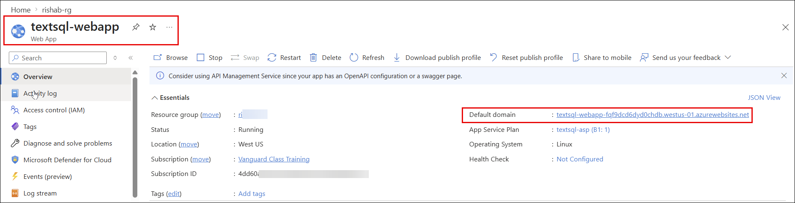

   ```
   https://textsql-webapp.azurewebsites.net
   ```

   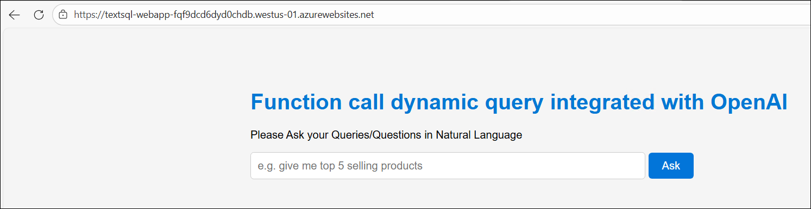

2. Type the following question and click **Ask**:

   ```
   Give me the top 5 selling products
   ```

   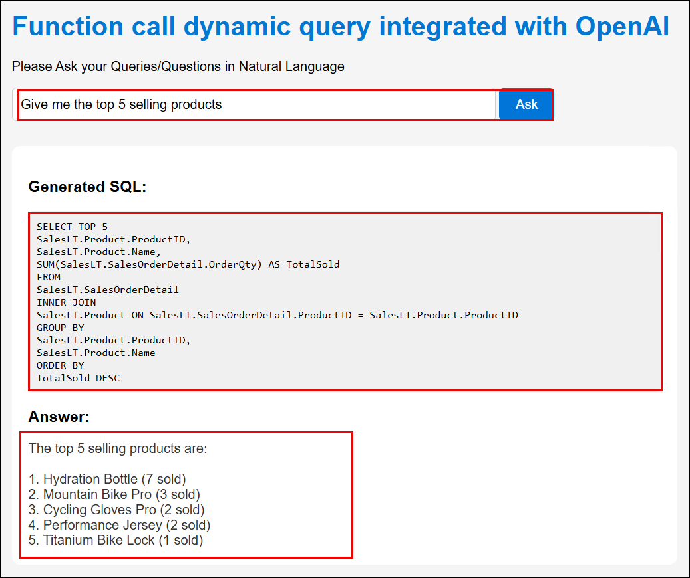

3. Verify the response shows the following:

   - **Generated SQL** — a valid SELECT query with TOP 5
   - **Answer** — product names from your actual database (Mountain Bike Pro, Road Bike Elite, etc.)

4. Try more questions to validate the application:

   | Question | Expected Result |
   |---|---|
   | `How many customers do we have?` | Returns count of 5 customers |
   | `Show me all products with their prices` | Lists all 10 products with ListPrice |
   | `Which customer placed the most orders?` | Returns customer name from SalesOrderDetail |
   | `What is the most expensive product?` | Returns Mountain Bike Pro at $1099.99 |

   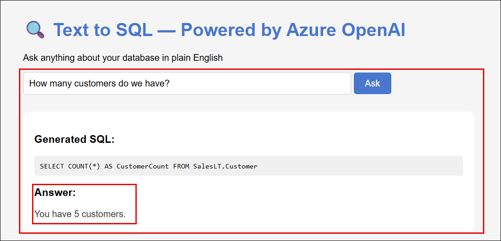

   > **Verify:** App returns real data from your Azure SQL Database for all test questions.

### Task 6: Verify in Azure Portal

As a final verification step, confirm everything is connected and running correctly from the Azure Portal.

1. Navigate to `textsql-webapp` in the Azure Portal.

2. Click **Overview** and verify Status = **Running**.

   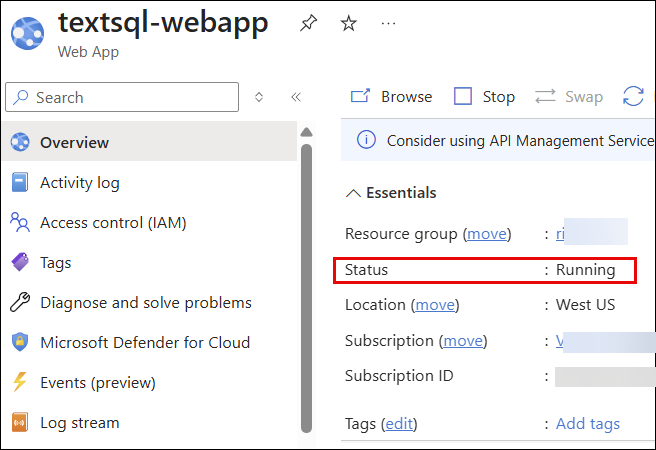

3. Click **Log stream** in the left pane to see live logs from the portal.

   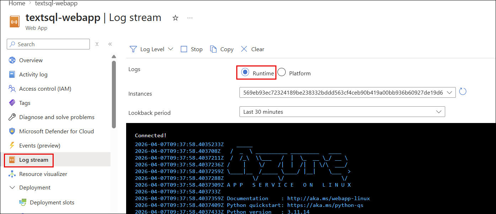

   > **Verify:** App Service is Running and logs are streaming.

## Review

In this lab, you have accomplished the following:

- Created all 3 application files locally: `main.py`, `requirements.txt`, and `startup.sh`
- Reviewed the complete application code including the FastAPI server, SQL connection, and OpenAI integration
- Deployed the application to Azure App Service using the Azure CLI
- Verified the deployment via live log streaming
- Tested the end-to-end Text-to-SQL pipeline using natural language questions
- Confirmed the App Service is running correctly from the Azure Portal

### You have successfully completed the lab.
