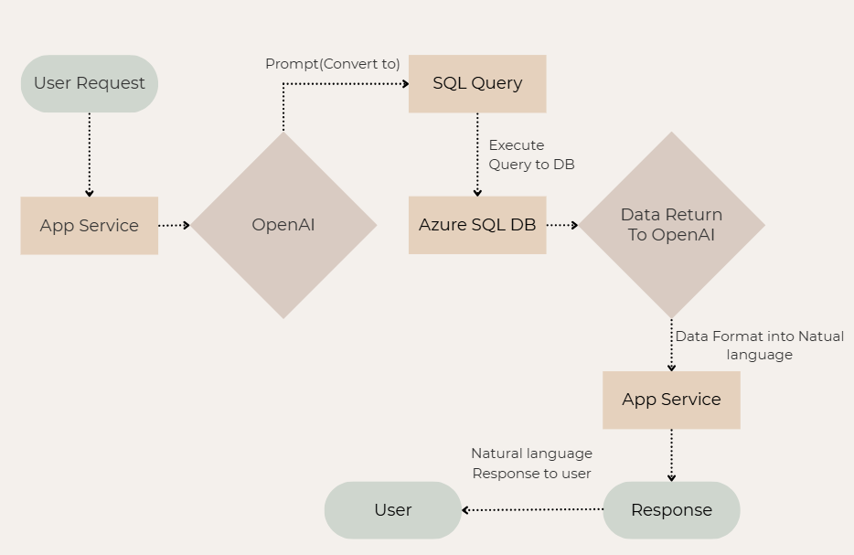
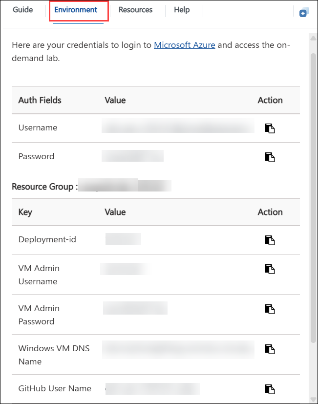
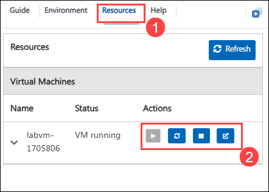
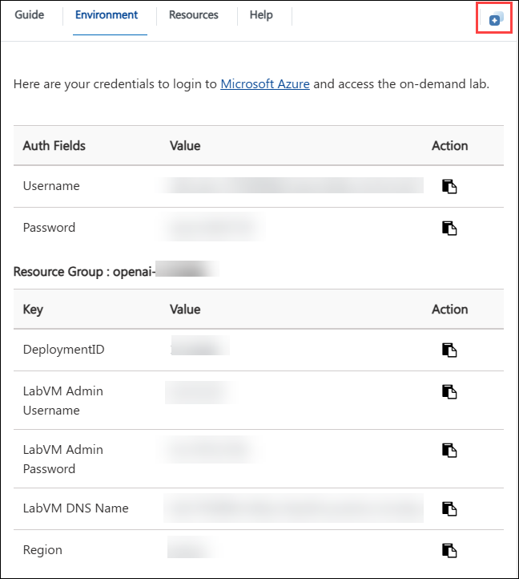
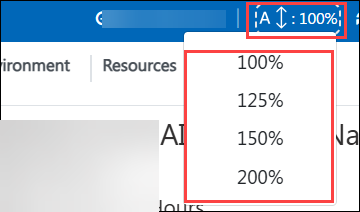
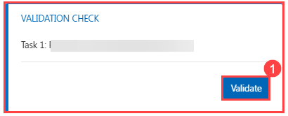
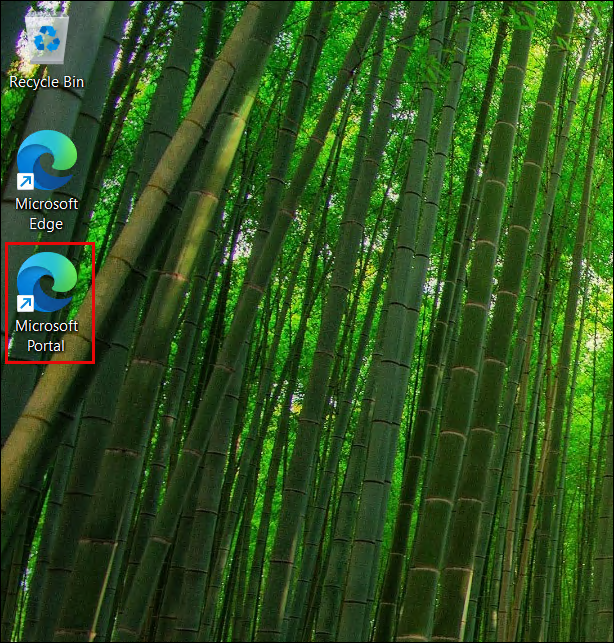
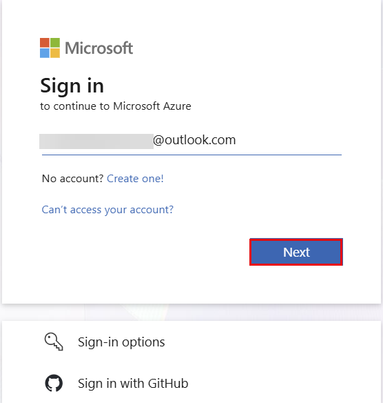
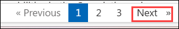

# Get Started with Function call Dynamic Query using Azure OpenAI and Azure SQL

### Overall Estimated Duration: 4 Hours

## Overview

Azure OpenAI Service brings the powerful generative AI models developed by OpenAI to the Azure platform, enabling developers to build intelligent applications with the security, scalability, and integration of Azure's cloud services. Azure SQL Database is a fully managed relational database service that provides high availability, built-in security, and enterprise-grade performance. In this lab, you will combine these two services to build a **Function Call Dynamic Query** application — a web application that allows users to ask natural language questions and receive answers drawn directly from a live SQL database. You will provision and configure Azure SQL Server, Azure OpenAI, and Azure App Service, implement passwordless authentication using Managed Identity, and deploy a Python FastAPI application that connects all of these services end to end.

## Objective

In this hands-on lab, you will learn how to build a complete Function call Dynamic Query solution on Microsoft Azure. You will start by provisioning the necessary infrastructure, configuring enterprise-grade security using Managed Identity, and deploying a Python web application that uses GPT-4.1 to convert natural language questions into SQL queries executed against a live Azure SQL Database. By the end of the lab, you will have a fully functional web application accessible via a public URL that answers database questions in plain English.

- **Provisioning Azure SQL Server & Database:** This hands-on lab task aims to create an Azure SQL Server with Microsoft Entra-only authentication, configure firewall rules, and set up the `SalesLT` database schema with sample customers, products, and sales order data using the Azure Portal's built-in Query Editor.

- **Creating Azure OpenAI Service & App Service:** This hands-on lab task aims to deploy an Azure OpenAI resource, deploy the GPT-4.1 model, create an App Service Plan and Web App configured for Python 3.11, and set all required environment variables and the startup command so the application can communicate with both OpenAI and SQL services.

- **Configuring Security & Managed Identity:** This hands-on lab task aims to implement passwordless authentication by creating a User Assigned Managed Identity, attaching it to the App Service, assigning the Cognitive Services OpenAI User RBAC role on the OpenAI resource, and creating SQL database users for both the Managed Identity and the App Service's System Assigned Identity.

- **Deploying the Application & Testing:** This hands-on lab task aims to create the application files locally (`main.py`, `requirements.txt`, `startup.sh`), deploy them to Azure App Service using the Azure CLI, verify the deployment via live log streaming, and test the complete end-to-end Function call Dynamic Query pipeline through the web interface.

## Pre-requisites

- Familiarity with the Azure Portal and basic Azure resource provisioning
- Basic understanding of Python and REST APIs
- Basic knowledge of SQL and relational databases
- Familiarity with Azure CLI commands

## Architecture

The architecture for this lab follows a multi-service pipeline on Azure. A user submits a natural language question through a web interface hosted on **Azure App Service**. The FastAPI application running on the App Service sends the question to **Azure OpenAI (GPT-4.1)**, which generates a valid SQL query based on the database schema provided in the system prompt. The App Service then executes that SQL query against **Azure SQL Database** using a secure, passwordless connection via **Managed Identity** — no credentials stored anywhere in the code. The query results are returned to the App Service, which sends them back to GPT-4.1 to format a natural language answer. That answer is displayed to the user in the browser. All Azure services reside within the same Resource Group (`textsql-rg`) in West US for low-latency communication.

## Architecture Diagram

## Explanation of Components

1. **Azure SQL Server & Database:** Azure SQL Database is a fully managed relational database service. In this lab, it hosts the `SalesLT` schema with three tables — `Customer`, `Product`, and `SalesOrderDetail` — which serve as the data source for all natural language queries.

1. **Azure OpenAI (GPT-4.1):** Azure OpenAI Service provides REST API access to OpenAI's powerful language models. The deployed GPT-4.1 model performs two roles in this lab: first, it converts the user's natural language question into a SQL query; second, it formats the raw database results into a clear, human-readable answer.

1. **Azure App Service:** Azure App Service is a fully managed platform for hosting web applications. In this lab, it runs the Python FastAPI application that orchestrates the entire Function call Dynamic Query pipeline — receiving user input, calling OpenAI, querying SQL, and returning the answer.

1. **Azure Managed Identity:** Managed Identity provides Azure services with an automatically managed identity in Azure Active Directory. In this lab, it enables the App Service to authenticate with both Azure OpenAI and Azure SQL Database without storing any passwords or API keys in the application code.

## Getting Started with the Lab

Welcome to the **Function call Dynamic Query using Azure OpenAI and Azure SQL** Workshop! In this lab, you will build a complete AI-powered application that translates natural language questions into SQL queries and returns intelligent answers from a live database. You will provision cloud infrastructure, configure enterprise security, write and deploy application code, and validate the end-to-end solution. Let's get started and explore the power of combining Azure OpenAI with Azure SQL.

## Accessing Your Lab Environment

Once you're ready to dive in, your virtual machine and lab guide will be right at your fingertips within your web browser.

## Virtual Machine & Lab Guide

Your virtual machine is your workhorse throughout the workshop. The lab guide is your roadmap to success.

## Exploring Your Lab Resources

To get a better understanding of your lab resources and credentials, navigate to the **Environment** tab.

## Utilizing the Split Window Feature

For convenience, you can open the lab guide in a separate window by selecting the **Split Window** button from the top right corner.

## Managing Your Virtual Machine

Feel free to **Start, Stop, or Restart (2)** your virtual machine as needed from the **Resources (1)** tab. Your experience is in your hands!

## Lab Guide Zoom In/Zoom Out

To adjust the zoom level for the environment page, click the **A↕: 100%** icon located next to the timer in the lab environment.

## Lab Validation

After completing each task, hit the **Validate** button under the Validation tab integrated within your lab guide. If you receive a success message, you can proceed to the next task. If not, carefully read the error message and retry the step, following the instructions in the lab guide.

## Let's Get Started with Azure Portal

1. In the LabVM, click on the **Azure portal** shortcut of the Microsoft Edge browser, which is created on the desktop.

   

1. You'll see the **Sign into Microsoft Azure** tab. Here, enter your credentials:

   - **Email/Username:** <inject key="AzureAdUserEmail"></inject>

     

1. Next, provide your password click **Sign in**

1. If prompted to **Stay Signed in**, click **No**.

1. If a **Welcome to Microsoft Azure** page appears, simply click **Cancel** to skip the tour.

## Support Contact

The CloudLabs support team is available 24/7, 365 days a year, via email and live chat to ensure seamless assistance at any time. We offer dedicated support channels tailored specifically for both learners and instructors, ensuring that all your needs are promptly and efficiently addressed.

Learner Support Contacts:

- Email Support: cloudlabs-support@spektrasystems.com
- Live Chat Support: https://cloudlabs.ai/labs-support

Now, click on **Next** from the lower right corner to move on to the next page.

## Happy Learning!!
